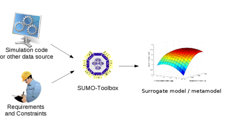
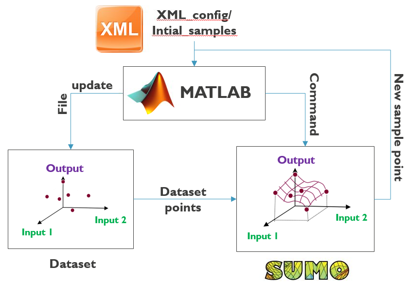

# SUrrogate MOdeling (SUMO) optimization

Many wireless networks that do exist today are difficult to be characterized in mathematical terms and thus we usually treat them as black box systems. Finding the optimum settings of a black box system is usually carried out by exhaustively searching the design space and selecting the optimum settings. In wireless networks, however, exhaustive searching is almost impossible since experimentation is an expensive operation. This mainly accounts to orchestration overheads, network delays and control plane unresponsiveness. To this end, one relies on optimization techniques to find the optimum design settings of wireless solutions. From a general perspective, optimization tools work in a search and concur principle. During the searching phase, also called exploration phase, they search the design space to get an overall view of the black box system. Later, they concur a specific region of the design space and exploit the optimum design parameters. Now speaking of optimization tools, there exist wide verities of them specifically tuned for different problem types. Here we will use the [SUrrogate MOdeling (SUMO)](http://sumo.intec.ugent.be/SUMO) toolbox for solving complex black box wireless problems.



*Figure 1. SUMO toolbox: Source, requirements and metamodel creation*

A complete tutorial about the principles of the SUMO toolbox is out of the scope of this tutorial and hence readers are advised to look the reference https://dl.acm.org/citation.cfm?id=1859919 for the details.


## SUMO toolbox

The SUMO toolbox is used for multiple use cases such as '*optimization*', '*model creation*', '*sensitivity analysis*', '*visualization*' and '*reliability analysis*'. Before solving any problem, the SUMO toolbox first builds a surrogate model from a dataset created by Design of Experiment (DoE) methods ('*Latin hypercube*', '*Box-Bhenken*', '*orthogonal*', etc.). Later, the SUMO toolbox applies a unique methodology for the given use case [optimization, model creation, sensitivity analysis, visualization and reliability analysis]. In this tutorial, we will only consider the optimization use case.


### Model creation

SUMO toolbox has a number of meta-modeling algorithms used to create the surrogate model. These are '*Rational functions*', '*Kriging models*', '*Artificial Neural Networks (ANN)*', '*splines*', and '*Support Vector Machines (SVM)*'. Again, an in-depth discussion is out of the scope of this tutorial but kriging models are used in this tutorial. The surrogate model created is representative of the size of a dataset. In general, as dataset size grows the surrogate model better approximates the black box system and the optimum region associated.


### Optimization

In the optimization phase, the SUMO toolbox provides the next sample point expecting it will improve the surrogate model and the optimum region associated. The choice of the surrogate modeling algorithm is crucial at this point because it affects the convergence speed of the optimization. Kriging models, for example, use '*Gaussian Processes (GP)*' to calculate the surrogate model and they are expected to provide better results for wireless networks since they share similar properties with wireless environments.


## Example

The SUMO toolbox is freely available as a MATLAB package and it can be downloaded from http://sumo.intec.ugent.be/SUMO_download. Once downloaded, extract the package and place it in a location where MATLAB has read and write access. Afterwards, set SUMO path variables inside MATLAB and it should be ready to execute optimization problems.

Out of the box, the SUMO toolbox is used as a complete multi-objective optimizer. It has a controller unit managing the optimization process and is configured by using an '*XML*' configuration file. Figure 2 shows the conceptual plot of the SUMO toolbox when used out of the box.



*Figure 2. SUMO toolbox out of the box*

After configuring the XML file, a user starts the optimization process and the progress is displayed (textual and graphical) on the screen until a stopping criteria is met. Moreover, a large number (60+) of examples are provided within the toolbox and it is easy to start working on a wide range of problems.

However ideal the default approach (using XML configuration) is for doing optimization, it is only applicable within a MATLAB framework and it lacks portability. One might want to do a single optimization process rather than a complete loop of many iterations or we might want to use a different controller external to MATLAB and yet achieve the same result. To this end, the controlling part of the SUMO toolbox is removed and an input/output SUMO interface is created over the optimization block. 

The SUMO interface is provided as a MATLAB script ('*SOSBO.m*' for single-objective and '*MOSBO.m*' for multi-objective) where it accepts a dataset file path and provides the next sample point along with a predicted performance. The predicted performance is the response of the next sample point over the surrogate model created. The dataset file starts with a header string followed by a number of input/output data that were performed on the black box system. An example dataset file is shown in Figure 3.

<table>
<tr><td colspan="6">[20 6 6400 0 ; 60 24 31200 16 ; 20 6 800 1 ];</td></tr>
<tr><td>40</td><td>12</td><td>14400</td><td>0</td><td>18.573</td><td>-4.1033539773</td></tr>
<tr><td>40</td><td>12</td><td>14400</td><td>0</td><td>18.573</td><td>-4.1033539773</td></tr>
<tr><td>40</td><td>18</td><td>15200</td><td>1</td><td>14.476</td><td>-4.0842513487</td></tr>
<tr><td>60</td><td>18</td><td>16000</td><td>1</td><td>11.456</td><td>-4.0407870192</td></tr>
<tr><td>40</td><td>6 </td><td>24800</td><td>2</td><td>68.696</td><td>-4.3299832188</td></tr>
</table>
Figure 3: An excerpt of a SUMO dataset file

The header string conveys four types of information; design parameter size, lower bound, upper bound and step width. From Figure 3, '*4*' design parameters are configured with in a range of '*[20:20:60]*','*[6:6:24]*', '*[6400:800:31200]*' and '*[0:1:16]*'. In total, there are '*3×4×32×17 = 6528*' parameter combinations. What follows the header string is a number of input/output data and we see 5 records each configuring four design parameters and measuring two performance objectives. From the SUMO toolbox perspective, Figure 3 is a multi-objective dataset since it measures two performance objectives.

### MATLAB

Assume we have a black box system with four parameters and two performance objectives. After performing 5 DoE experiments as shown in Figure 3, we want to optimize and calculate the next sample point using the SUMO toolbox.

Create a dataset file similar to Figure 3.
```bash
echo -e "[20 6 6400 0 ; 60 24 31200 16 ; 20 6 800 1 ];\n40\t12\t14400\t0\t18.573\t-4.1033539773\n40\t12\t14400\t0\t18.573\t-4.1033539773\n40\t18\t15200\t1\t14.476\t-4.0842513487\n60\t18\t16000\t1\t11.456\t-4.0407870192\n40\t6\t24800\t2\t68.696\t-4.3299832188" > /home/ewine/sumo-toolbox/samplesValues.txt
```

Copy the multi-objective SUMO interface file into the matlab source directory
```bash
cp MOSBO.m /home/ewine/sumo-toolbox/src/matlab
```

Start MATLAB program
```bash
/home/ewine/MATLAB/bin/matlab -nodesktop –nosplash
```

From MATLAB workspace, navigate into the SUMO toolbox directory
```matlab
cd /home/ewine/sumo-toolbox
```

Set SUMO toolbox path variables
```matlab
startup
```

Execute the SUMO multi-objective optimizer
```matlab
[newSample pred_obj] = MOSBO('/home/ewine/sumo-toolbox/samplesValues.txt', [5,6]);
```

The result is displayed on the MATLAB screen where next_sample = [20 24 6400 14] and pred_obj = [39.6004 -4.1898]


### Node-red

In the previous example, a multi-objective black-box system was optimized inside a MATLAB framework. Now let us see how it is done using external frameworks outside MATLAB. This time, we will use the [node-red](https://nodered.org/) graphical framework. Node-red is a front-end built on top of the [node.js](https://nodejs.org/) JavaScript runtime engine and is used for wiring together hardware devices, APIs and online services in new and interesting ways. In order to use the SUMO toolbox within the node-red framework, we have built a generic SUMO node which internally calls a MATLAB daemon program. By default MATLAB is designed to work as a standalone program where it gets started to execute commands/scripts and stopped at the end of operation. There is no built in mechanism to run MATLAB as a daemon program and use it as a background service. The advantage of doing this saves MATLAB's startup time that would rather pile-up and consumes a huge portion of the experimentation time specially when performing iterative and optimization problems.


### Running MATLAB as a daemon program

Copy the MATLAB daemon (matlabd) program to the /usr/local/bin/ directory
```bash
sudo cp matlabd /usr/local/bin/matlabd
```

Update the MATLAB executable path inside the matlabd program
```bash
sudo sed -i 's/MATLAB=.*/MATLAB="\/home\/ewine\/MATLAB\/bin\/matlab -nosplash -nodesktop"/g' /usr/local/bin/matlabd
```

Copy kill.m and kill.mexa64 files into MATLAB toolbox folder
```bash
cp kill.m kill.mexa64 /home/ewine/MATLAB/toolbox/local
```

Check that matlabd is working
```bash
matlabd "1+2"

ans =
3
```
You might need to re-execute the command (matlabd "1+2") if it hangs on the screen. However, once matlabd is started consecutive command/script executions become much faster. 

On the other hand, executing a MATLAB script is done by passing the full path of the script as an argument to matlabd. Moreover, it is advisable to clear the workspace before executing a script since the state of the workspace is not known beforehand.
```bash
printf "clear\n1+2\n" > /home/ewine/test.m
matlabd /home/ewine/test.m
```

After making sure that MATLAB daemon is working, it is time to execute a SUMO optimization problem within the node-red framework. There are two things we need to do beforehand.

First, install the SUMO node inside node-red framework
```bash
mkdir -p /home/ewine/.node-red/node_modules
cp -r node-red-SUMO /home/ewine/.node-red/node_modules/
```

Next, configure MATLAB to set SUMO path variables every time it is started
```bash
cp /home/ewine/sumo-toolbox/startup.m /home/ewine/MATLAB/toolbox/local
```

Finally create a node-red flow, shown in Figure 4, to execute a single level SUMO optimization.


*Figure 4. SUMO optimization node-red flow*

The code behind Figure 4 is stored in the file '*SUMO_opt.flow*'. Make a special attention that the payload pushed to the SUMO node is an array of filename objects and it possible to optimize multiple multi-objective problems. Executing the flow of Figure 4, clicking the start button, performs the same operation as we did in the MATLAB section. You might need to wait for the first time or re-start the flow again until the MATLAB program is up and running.


## Contact

michael.mehari@ugent.be

